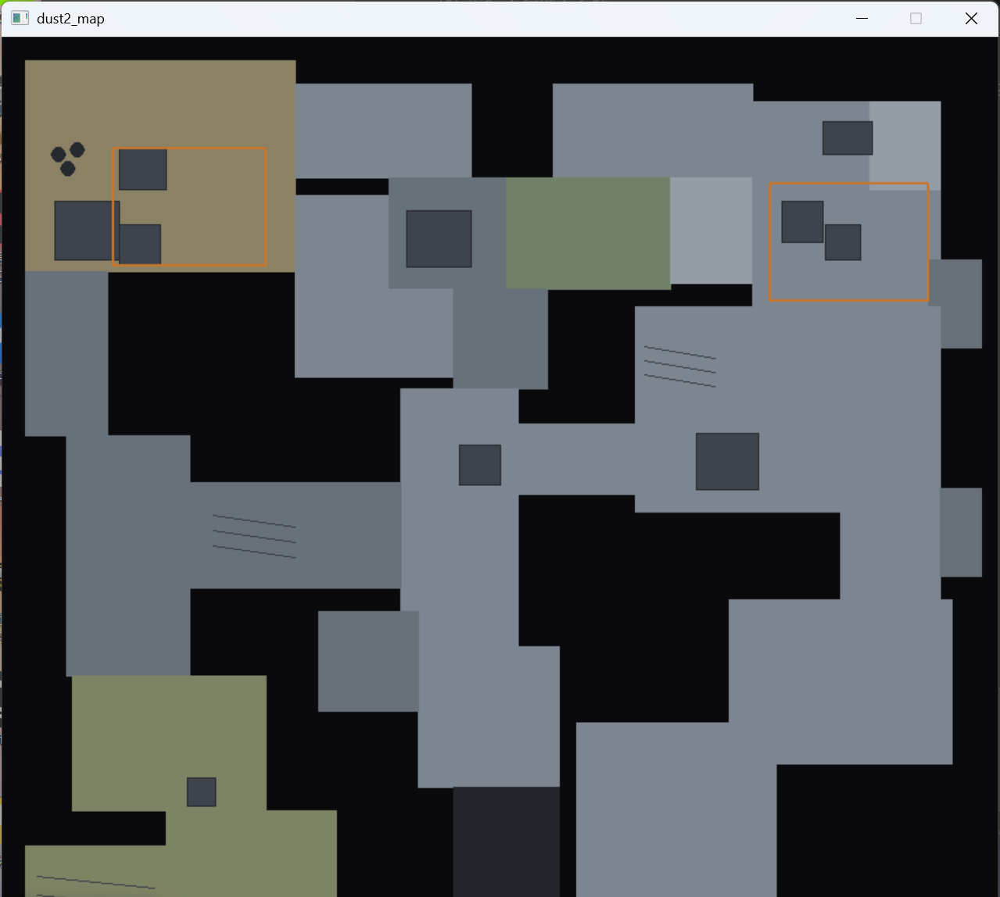

  
&nbsp;
  

---

> 一个大一新生的 C++ 学习作品集 —— 从课程作业到自制小游戏，一行一行写出来。

🔗 **在线访问：[https://liuzhou191137.github.io](https://liuzhou191137.github.io)**

## ✨ 作品收录

| 作品 | 状态 | 技术 |
|---|---|---|
| [de_dust2 雷达俯视图](https://liuzhou191137.github.io) | ✅ 已完成 | C++ · EasyX · 结构体数组 |
| 反应球训练器 | 🚧 开发中 | EasyX · 消息轮询 · 双缓冲 |
| 通讯录管理系统 | ✅ 已完成 | 结构体 · 函数拆分 |
| 飞机大战（逐版本长大） | 📋 规划中 | — |
| 2048 / 五子棋 AI | 🔒 待解锁 | STL |

## 🧰 我的工具箱

  

## 🛠 关于这个网站

- **单文件，零依赖**：整个网站就是一个 38KB 的 `index.html`，地图截图以 base64 直接内嵌——把这一个文件发给任何人，微信里都能完整打开。
- **数据表驱动**：作品卡片、技能条都按「数据 + 渲染」组织。和用 C++ 结构体数组画地图是同一个思想，只是渲染器从 EasyX 换成了浏览器。
- **持续生长**：学习进度板块与「C++ 学习分析系统」的本地数据库同步更新，每完成一轮训练就涨一格。

## 📈 更新日志

- **2026-09-27 · v1.1**：README 换装——渐变横幅、打字机自我介绍、工具箱图标墙、访问计数。
- **2026-09-27 · v1**：上线。首件展品：纯 C++ + EasyX 逐坐标手绘的 de_dust2 雷达俯视图（39 组地块数据 + 3 个绘制函数 + 1 个循环）。

---

*用 C++ 与 EasyX 一行一行画出来 · 目标：图形化小游戏*

